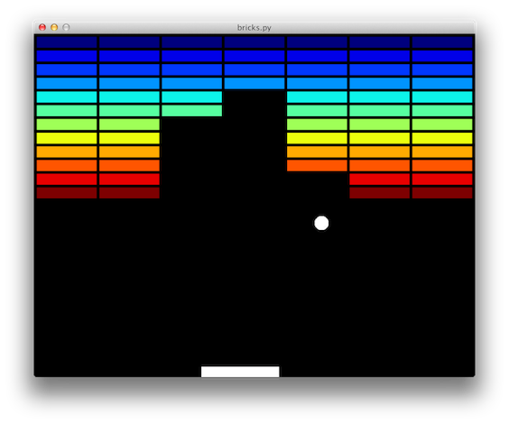

About
=====

Experimental clone of the classic 'brick breaking' games. This is just for fun
and to experiment with the [pyglet](http://www.pyglet.org) library.

**Note:** This is not feature complete in any way!

Installing
==========

This requires [Numpy](http://www.numpy.org),
[Matplotlib](http://www.matplotlib.org), and [Pyglet](http://pyglet.org). The latter can easily be installed with:

    pip install pyglet

For now this repository is not a package, so you don't need to install it - just clone the repository and you are good to go:

    git clone https://github.com/astrofrog/bricks
    cd bricks

Running
=======

To run:

    python bricks.py

If the ball hits the bottom of the screen, just click to start the ball again.

Customizing
===========

All visual aspects of the game can be edited in ``settings.py`` for now.

